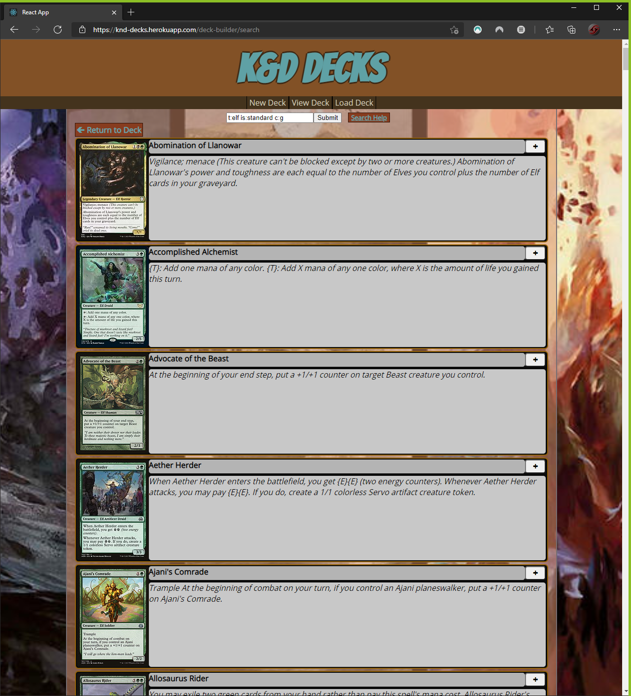

# K&D Decks

## Getting Started

You can either access the application [here](https://knd-decks.herokuapp.com/deck-builder) or you can host it yourself with the following steps.

### Cloning Repository

The first step in using the application is to clone the repository with the following command:
`git clone https://github.com/khalilcampbell7/project1.git`

### Initializing Application

Navigate to the react directory:
`cd project1/my-app`
In order for the application to run, you must install all required packages:
`npm install`

### Launching the Application

Once the packages are installed, simply launch the application:
`npm start`

## Navigating K&D Decks

Please see the following diagram for general site navigation.


### Making a New Deck


### Searching for Cards

In the search bar type in your search criteria.  If you need help with syntax, there is a helpful link to navigate to a help page.  By default, text will search the descriptions and names for a match for your text.  Modifiers can be added as follows:

```
t:type (t:dragon => dragon, elf, legend, land, instant)
c:color (c:b => b-black, r-red, g-green, u-blue, w-white)
o:text-box (o:draw => draw, "~ enters the battlefield")
pow>=number (pow>=8 => cards with 8 or more power)
r:rarity (r:common => common, uncommon, rare, mythic)
is:legality (is:standard => is card legal in format)
```

#### Search Example

If I wanted to look for all Elf type cards that are currently standard that can go in a green deck, I would type the following:
`t:elf is:standard c:g`
To get the following results:



### Adding Cards to Deck

After submitting your search, a list of cards will populate, assuming the search yields results.  Simply press the + button on the resultant card.  In the deck view you can press - and + to remove and add copies of the card respectively.

### Exporting Deck

Once the deck is built, return to the deck view page and click export at the end of the deck list.  A file will be downloaded, save this file in a location you will remember.

### Importing Deck

To import a deck, either on the default page or in the nav bar, click "Load Deck" then click on the "Upload" button to upload a previously saved JSON deck.